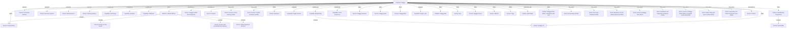

```mermaid
graph TD
    swiggy["Company: Swiggy"]
    swiggyplatform["Platform: Unified Platform"]
    fooddelivery["Service: Food Delivery"]
    diningoutevents["Service: Dining out and Events"]
    grocerydelivery["Service: Grocery and Household items delivery"]
    otherhyperlocalservices["Service: Other hyperlocal services"]
    restaurantpartners["Partner: Restaurant partners"]
    merchantpartners["Partner: Merchant partners"]
    brandpartners["Partner: Brand partners"]
    deliverypartners["Partner: Delivery partners"]
    technology["Capability: Technology"]
    analytics["Capability: Analytics"]
    fulfilment["Capability: Fulfilment"]
    membership["Capability: Membership"]
    swiggyone["Feature: Swiggy one"]
    source_5["Source: Swiggy Limited IPO Prospectus"]
    source_6["Source: Chunk 6"]
    e2014["Event: Pioneer in Food Delivery (2014)"]
    e2020["Event: Pioneer in Quick Commerce (2020)"]
    instamart["Service: Instamart"]
    dineout["Acquisition Target: Dineout"]
    membershipprogramme["Feature: Membership Programme"]
    quickcommerce["Capability: Quick Commerce"]
    quickbites["Product: Quick Bites"]
    swiggyinstamart["Service: Swiggy Instamart"]
    swiggygenie["Service: Swiggy Genie"]
    swiggyminis["Service: Swiggy Minis"]
    lynk["Acquisition Target: Lynk"]
    swiggymall["Platform: Swiggy Mall"]
    bolt["Service: Bolt"]
    swiggyscenes["Service: Swiggy Scenes"]
    snacc["Service: SNACC"]
    pyng["Service: Pyng"]
    hdfcbank["Partner: HDFC Bank"]
    swiggyhdfccreditcard["Product: Swiggy-HDFC Bank co-branded credit card"]
    e2013["Event: Incorporation (2013)"]
    e2015["Event: First major fundraise (2015)"]
    e2019["Event: Expansion of food delivery business (2019)"]
    e2021["Event: Launch of Swiggy One (2021)"]
    e2022["Event: Acquisition and integration of Dineout (2022)"]
    e2023["Event: Launch of Swiggy-HDFC Bank co-branded credit card (2023)"]
    e2024["Event: Public listing and launch of Bolt (2024)"]
    e2025["Event: Surpassing 120 million transacted users (2025)"]
    source_7["Source: Chunk 7"]
    swiggy -->|offers| swiggyplatform
    swiggyplatform -->|includes| fooddelivery
    swiggyplatform -->|includes| diningoutevents
    swiggyplatform -->|includes| grocerydelivery
    swiggyplatform -->|includes| otherhyperlocalservices
    swiggy -->|operates| restaurantpartners
    swiggy -->|operates| merchantpartners
    swiggy -->|operates| brandpartners
    swiggy -->|operates| deliverypartners
    swiggy -->|enabled_by| technology
    swiggy -->|enabled_by| analytics
    swiggy -->|enabled_by| fulfilment
    swiggy -->|enabled_by| membership
    membership -->|includes| swiggyone
    swiggy -->|described_in| source_5
    swiggy -->|described_in| source_6
    swiggy -->|has_event| e2014
    swiggy -->|has_event| e2020
    swiggy -->|offers| instamart
    swiggy -->|acquired| dineout
    swiggy -->|offers| membershipprogramme
    swiggy -->|offers| fooddelivery
    swiggy -->|enabled_by| quickcommerce
    membershipprogramme -->|includes| quickbites
    swiggy -->|described_in| source_7
    swiggy -->|offers| swiggyinstamart
    swiggy -->|offers| swiggygenie
    swiggy -->|offers| swiggyone
    swiggy -->|offers| swiggyminis
    swiggy -->|acquired| lynk
    swiggy -->|offers| swiggymall
    swiggy -->|offers| bolt
    swiggy -->|offers| swiggyscenes
    swiggy -->|offers| snacc
    swiggy -->|offers| pyng
    swiggy -->|partnered_with| hdfcbank
    swiggy -->|offers| swiggyhdfccreditcard
    swiggy -->|has_event| e2013
    swiggy -->|has_event| e2015
    swiggy -->|has_event| e2019
    swiggy -->|has_event| e2021
    swiggy -->|has_event| e2022
    swiggy -->|has_event| e2023
    swiggy -->|has_event| e2024
    swiggy -->|has_event| e2025
```